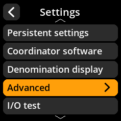

# Compact SeedQR

Configure SeedQR compression settings for more efficient QR codes.

## Step-by-Step Process

1. **Navigate**: Settings → **Advanced** → **Compact SeedQR**
2. **Choose Mode**:
   - **Enabled** - Use compact SeedQR format (default)
   - **Disabled** - Use standard SeedQR format

{w=250px align=center}

{w=250px align=center}

{w=250px align=center}

{w=250px align=center}
