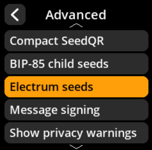
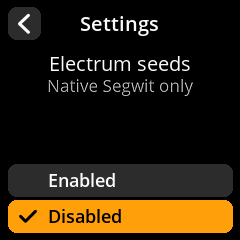

# Electrum Seeds

Configure support for Electrum-style seed phrases.

## Step-by-Step Process

1. **Navigate**: Settings → **Advanced** → **Electrum Seeds**
2. **Choose Mode**:
   - **Enabled** - Support Electrum seed format
   - **Disabled** - Standard BIP-39 only (default)

{w=250px align=center}

{w=250px align=center}

{w=250px align=center}

{w=250px align=center}
