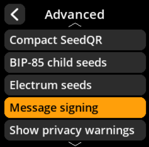
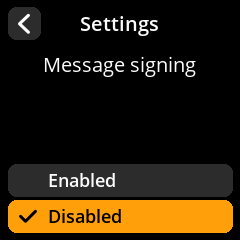

# Message Signing

Enable cryptographic message signing functionality.

## Step-by-Step Process

1. **Navigate**: Settings → **Advanced** → **Message Signing**
2. **Choose Mode**:
   - **Enabled** - Allow message signing
   - **Disabled** - Disable message signing (default)

{w=250px align=center}

{w=250px align=center}

{w=250px align=center}

{w=250px align=center}
