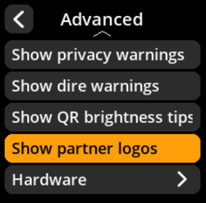
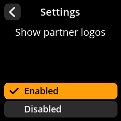

# Partner Logos

Control display of partner and wallet provider logos.

## Step-by-Step Process

1. **Navigate**: Settings → **Advanced** → **Show Partner Logos**
2. **Choose Display Mode**:
   - **Enabled** - Show partner logos (default)
   - **Disabled** - Hide partner logos

{w=250px align=center}

{w=250px align=center}

{w=250px align=center}

{w=250px align=center}
