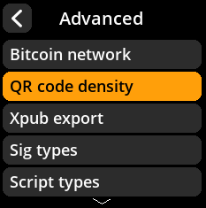
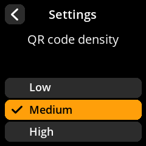

# QR Code Density

Adjust the density of generated QR codes to balance size and scannability.

## Step-by-Step Process

1. **Navigate**: Settings → **Advanced** → **QR Code Density**
2. **Choose Density**:
   - **Low** - Larger, easier to scan QR codes
   - **Medium** - Balanced size and compatibility (default)
   - **High** - Smaller, more data-dense QR codes

{w=250px align=center}

{w=250px align=center}

{w=250px align=center}

{w=250px align=center}
