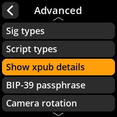
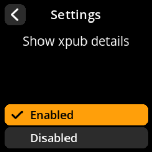

# Show Xpub Details

Control whether extended public key details are displayed.

## Step-by-Step Process

1. **Navigate**: Settings → **Advanced** → **Show Xpub Details**
2. **Choose Display Mode**:
   - **Enabled** - Show detailed xpub information (default)
   - **Disabled** - Hide xpub details

{w=250px align=center}

{w=250px align=center}

{w=250px align=center}

{w=250px align=center}
