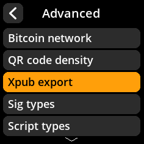
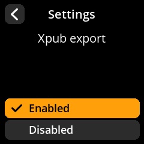

# Xpub Export Configuration

Control extended public key export functionality.

## Step-by-Step Process

1. **Navigate**: Settings → **Advanced** → **Xpub Export**
2. **Choose Mode**:
   - **Enabled** - Allow xpub export (default)
   - **Disabled** - Disable xpub export functionality

{w=250px align=center}

{w=250px align=center}

{w=250px align=center}

{w=250px align=center}
