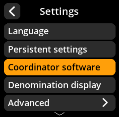
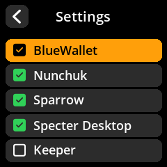

# Coordinator Software Support

Enable or disable support for specific wallet applications. This customizes QR code formats and compatibility.

## Step-by-Step Process

1. **Navigate**: Main Menu → **Settings** → **Coordinator Software**
2. **Configure Support** for each wallet:
   - ✅ **BlueWallet** - Mobile Bitcoin wallet
   - ✅ **Nunchuk** - Collaborative custody wallet  
   - ✅ **Sparrow Wallet** - Desktop Bitcoin wallet
   - ✅ **Specter Desktop** - Privacy-focused wallet
   - ✅ **Keeper** - Inheritance planning wallet

{w=250px align=center}

{w=250px align=center}

{w=250px align=center}
