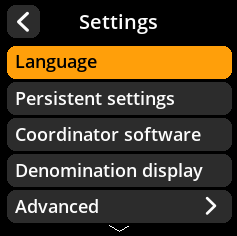
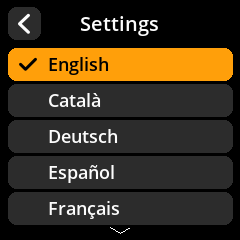

# Language Configuration

Set your preferred language for the SeedSigner interface.

## Step-by-Step Process

1. **Navigate**: Main Menu → **Settings** → **Language**
2. **Select Language**: Choose your preferred language from the available options
3. **Confirm Selection**: The interface will update to use your chosen language

{w=250px align=center}

{w=250px align=center}

{w=250px align=center}
