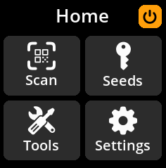
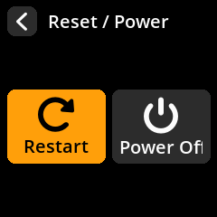

# Powering Off Safely

**Method 1: Proper Shutdown**

1. Navigate to the **power icon** (top right of main menu)

{w=250px align=center}

2. Press any key to open the power menu

{w=250px align=center}

3. Select **"Power Off"** and confirm your choice

{w=250px align=center}

**Method 2: Direct Unplugging**
You can safely unplug the device at any time. SeedSigner stores nothing permanently, so all sensitive data is automatically cleared when power is removed.
