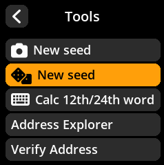

# Dice-Based Seed Generation

Generate seeds using physical dice for maximum security and provable randomness. This method is preferred by security-conscious users who want complete control over the randomness source.

## Complete Step-by-Step Process with All Screenshots

1. **Navigate**: Main Menu → **Tools**

{w=250px align=center}

2. **Select Method**: Choose **"New Seed"** with the dice icon

{w=250px align=center}

3. **Choose Length**:
   - **12 words** requires 50 dice rolls
   - **24 words** requires 99 dice rolls (recommended)

{w=250px align=center}

4. **Prepare Physical Dice**: Use a standard 6-sided die

5. **Roll and Enter**:
   - Roll your physical die
   - Select the corresponding number (1-6) on the screen by pressing the **Joystick**
   - Repeat for all required rolls

{w=250px align=center}

6. **Complete All Rolls**: The progress indicator shows your completion status

{w=250px align=center}

7. **Acknowledge Security Warning**: Press **"I Understand"** after reading the classified information warning

{w=250px align=center}

8. **Record Generated Words**: Write down all seed words in order

{w=250px align=center}

9. **Verify Your Backup**: Complete the verification process

{w=250px align=center}

> **🎲 Why Use Dice?** Physical dice provide true randomness that cannot be compromised by software vulnerabilities, hardware backdoors, or electromagnetic interference. This method gives you complete control over the entropy source.
