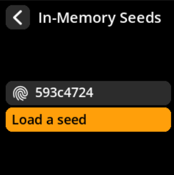
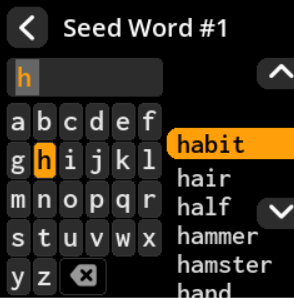

# Manual Seed Entry

Enter your existing mnemonic phrase using the on-screen keyboard system.

## Complete Step-by-Step Process with All Screenshots

1. **Navigate**: Main Menu → **Seeds** → **"Load a Seed"**

{w=250px align=center}

{w=250px align=center}

2. **Choose Length**: Select **"Enter 12-word seed"** or **"Enter 24-word seed"**

{w=250px align=center}

{w=250px align=center}

3. **Enter Each Word**:
   - Use the on-screen keyboard with intelligent word suggestions
   - Type the first few letters and select from suggestions for faster entry
   - **Key A**: Move up in the suggestions list
   - **Key C**: Move down in the suggestions list  
   - **Key B**: Select the highlighted suggested word

{w=250px align=center}

4. **Review Seed Fingerprint**: Check the unique identifier on the "Finalize Seed" screen

{w=250px align=center}

5. **Complete Loading**:
   - Select **"Done"** to load the seed as-is
   - Or select **"BIP-39 Passphrase"** to add an additional security layer

> **⚡ Speed Tip**: The word suggestion feature dramatically speeds up entry. Type just the first 2-3 letters of each word and select from the filtered suggestions rather than typing each letter individually.
