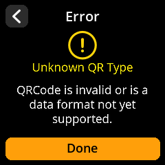

# SeedQR Scanning

Quickly and securely load seeds from SeedQR codes - a compact QR code format specifically designed for seed phrases.

## Complete Step-by-Step Process with All Screenshots

1. **Navigate**: Main Menu → **Scan**

{w=250px align=center}

2. **Position QR Code**: Point the camera at your SeedQR code

{w=250px align=center}

3. **Wait for Recognition**: The device will automatically detect and process valid SeedQR codes

4. **Review Details**: Check the seed information on the "Finalize Seed" screen

{w=250px align=center}

5. **Handle Errors**: If you see "Unknown QR Type", the QR code format isn't recognized

{w=250px align=center}

6. **Complete Loading**: Select **"Done"** to load the seed

> **❌ Troubleshooting**: If you see "Unknown QR Type", the QR code format isn't recognized as a valid SeedQR. Press "Done" to return to scanning mode and verify you're using a properly formatted SeedQR code.
