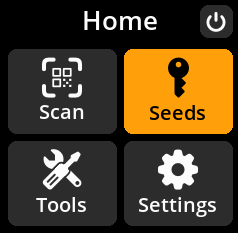
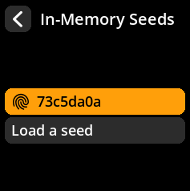
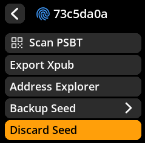
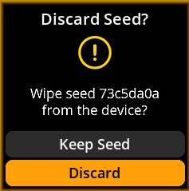
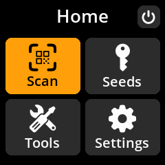

# Discard Loaded Seed

Safely remove the current seed from memory when you're finished with your operations.

## Complete Step-by-Step Process with All Screenshots

1. **Navigate**: `Home → Seeds → [Select Seed] → Discard Seed`

{w=250px align=center}

{w=250px align=center}

{w=250px align=center}

2. **Confirm Discard**: Select **"Discard"** to remove the seed from memory

{w=250px align=center}

3. **Return to Main Menu**: You'll be returned to the main menu with no seed loaded

{w=250px align=center}

> **🧹 Memory Clearing**: Discarding a seed completely removes it from device memory. This is a security best practice when switching between different seeds or when finished with operations.
