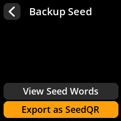
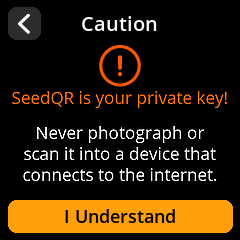
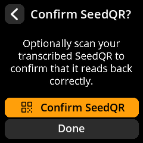
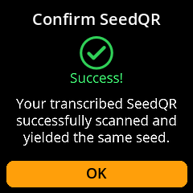
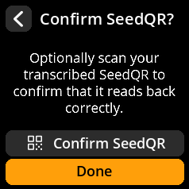

# Create SeedQR Backup

Generate compact QR code backups of your seed phrase for convenient storage and recovery.

## Complete Step-by-Step Process with All Screenshots

1. **Navigate**: `Home → Seeds → [Select Seed] → Backup Seed → View Seed Words`

{w=250px align=center}

{w=250px align=center}

{w=250px align=center}

{w=250px align=center}

2. **Choose Format**:
   - **"Standard: 25x25"** - Larger, easier to scan
   - **"Compact: 21x21"** - Smaller, requires more precise scanning

{w=250px align=center}

3. **Acknowledge Warning**: Confirm that you understand SeedQR contains your complete private key

{w=250px align=center}

4. **Review Complete QR**: View the full QR code, then select **"Begin"** to examine zoomed sections

{w=250px align=center}

5. **Navigate All Sections**: Use the joystick to review every part of the QR code for accuracy

{w=250px align=center}

6. **Complete Review**: Press any key to proceed. You'll see two options:
   - **"Confirm SeedQR"** - Verify the generated QR code is correct
   - **"Done"** - Return to Seeds main screen

{w=250px align=center}

   **If you select "Confirm SeedQR":**

- The device camera will open to scan the transcribed QR code
- Show the transcribed QR image to the camera for verification
- The system will confirm whether the correct image was captured

{w=250px align=center}

   **Success Message:**
{w=250px align=center}

   **Failure Message:**
{w=250px align=center}

   **If you select "Done":**

- You'll be redirected back to the Seeds main screen

{w=250px align=center}

> **⚠️ Security Equivalent**: SeedQR codes are functionally equivalent to your written seed backup. Store them with the same security measures - in fireproof safes, safety deposit boxes, or other secure locations.
