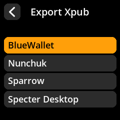
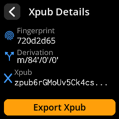

# Export Public Key (Xpub)

Create watch-only wallets in your favorite Bitcoin software by exporting your public key. This allows you to monitor balances and prepare transactions without exposing your private keys.

## Complete Step-by-Step Process with All Screenshots

1. **Access Export**: From the seed's main screen, select **"Export Xpub"**

{w=250px align=center}

2. **Choose Signature Type**:
   - **"Single Sig"** - For standard personal wallets
   - **"Multisig"** - For multi-signature wallets requiring multiple devices

{w=250px align=center}

3. **Select Script Type**:
   - **Native Segwit** (bech32) - Recommended for lowest fees
   - **Nested Segwit** (P2SH) - For compatibility with older systems
   - **Taproot** - For advanced privacy and smart contract features

{w=250px align=center}

4. **Choose Wallet Software**: Select your preferred wallet from supported options

{w=250px align=center}

5. **Acknowledge Privacy Warning**: Press **"I Understand"** after reading the xpub privacy implications

{w=250px align=center}

6. **Generate QR Code**: Select **"Export XPub"** to display the shareable QR code

{w=250px align=center}

7. **Import to Wallet**: Scan the QR code with your chosen wallet software

{w=250px align=center}

> **🔒 Privacy Warning**: Your xpub (extended public key) reveals all your Bitcoin addresses and transaction history. Only share it with wallet software you trust, and never post it publicly online.
