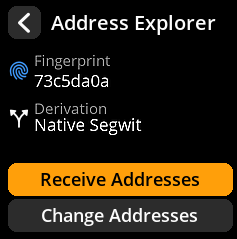
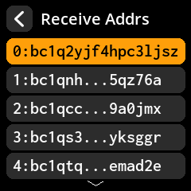

# Generate Receiving Addresses

View and share your Bitcoin receiving addresses for accepting payments.

## Complete Step-by-Step Process with All Screenshots

**Navigation Path**: `Home → Seeds → [Select Seed] → Address Explorer`

{w=250px align=center}

{w=250px align=center}

{w=250px align=center}

**Process Flow**:

1. **Script Type Selection** → Choose your preferred address format

{w=250px align=center}

2. **Address Generation** → Select "Receive addresses"

{w=250px align=center}

3. **Address List** → Browse available addresses (paginated: 10 per view)

{w=250px align=center}

4. **QR Code Generation** → Tap any address for shareable QR code

{w=250px align=center}

> **💡 Best Practice**: Generate a new receiving address for each transaction to maintain privacy. Bitcoin addresses can be reused but it's not recommended for privacy reasons.
