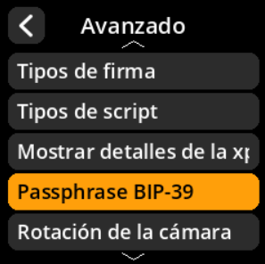
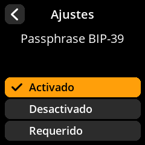

# Configuración de la contraseña BIP-39

Controle cómo el dispositivo gestiona las contraseñas BIP-39.

## Proceso paso a paso

1. **Navegar**: Menú principal → **Ajustes** → **Avanzado** → **Passphrase BIP-39**
2. **Seleccionar modo**:
     - **Activado** - La contraseña es opcional (configuración recomendada por defecto)
     - **Desactivado** - No se admiten contraseñas
     - **Requerido** - Cada semilla debe tener una contraseña

{w=250px align=center}

{w=250px align=center}

{w=250px align=center}

{w=250px align=center}
