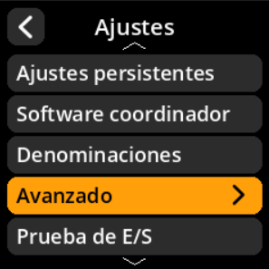

# Rotación de la cámara

Ajusta la orientación de la cámara según la configuración de tu dispositivo.

## Proceso paso a paso

1. **Navegar**: Menú principal → **Ajustes** → **Avanzado** → **Rotación de la cámara**
2. **Seleccionar rotación**:
     - **0 grados** - Sin rotación
     - **90 grados** - Giro de un cuarto en sentido horario
     - **180 grados** - Invertido (predeterminado en la mayoría de las configuraciones)
     - **270 grados** - Giro de un cuarto en sentido antihorario

{w=250px align=center}

{w=250px align=center}

{w=250px align=center}

{w=250px align=center}
