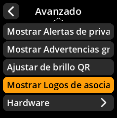
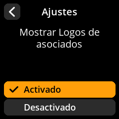

# Logotipos de socios

Controla la visualización de los logotipos de socios y proveedores de billeteras.

## Proceso paso a paso

1. **Navegar**: Menú principal → **Ajustes** → **Avanzado** → **Mostrar Logos de asociados**
2. **Seleccionar modo de visualización**:
     - **Activado** - Mostrar logotipos de socios (predeterminado)
     - **Desactivado** - Ocultar logotipos de socios

{w=250px align=center}

{w=250px align=center}

{w=250px align=center}

{w=250px align=center}
