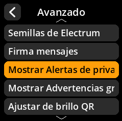
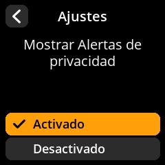

# Advertencias de privacidad

Controla la visualización de advertencias y notificaciones relacionadas con la privacidad.

## Proceso paso a paso

1. **Navegar**: Menú principal → **Ajustes** → **Avanzado** → **Mostrar Alertas de privacidad**
2. **Seleccionar modo de visualización**:
     - **Activado** - Mostrar advertencias de privacidad (predeterminado)
     - **Desactivado** - Ocultar advertencias de privacidad

{w=250px align=center}

{w=250px align=center}

{w=250px align=center}

{w=250px align=center}
