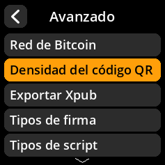
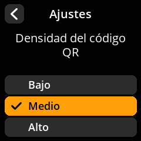

# Densidad del código QR

Ajuste la densidad de los códigos QR generados para equilibrar el tamaño y la legibilidad.

## Proceso paso a paso

1. **Navegar**: Menú principal → **Ajustes** → **Avanzado** → **Densidad del código QR**
2. **Seleccionar densidad**:
     - **Bajo** - Códigos QR más grandes y fáciles de escanear
     - **Medio** - Tamaño equilibrado y compatibilidad (predeterminado)
     - **Alto** - Códigos QR más pequeños y con mayor densidad de datos

{w=250px align=center}

{w=250px align=center}

{w=250px align=center}

{w=250px align=center}
