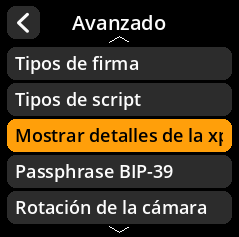
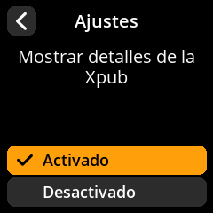

# Mostrar detalles de Xpub

Controla si se muestran los detalles extendidos de la clave pública.

## Proceso paso a paso

1. **Navegar**: Menú principal → **Ajustes** → **Avanzado** → **Mostrar detalles de la Xpub**
2. **Seleccionar modo de visualización**:
     - **Activado** - Mostrar información detallada de Xpub (predeterminado)
     - **Desactivado** - Ocultar detalles de Xpub

{w=250px align=center}

{w=250px align=center}

{w=250px align=center}

{w=250px align=center}
