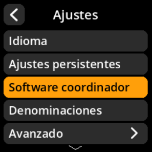
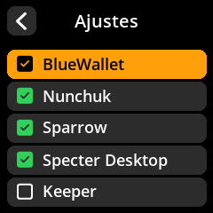

# Soporte de Software del Coordinador

Habilite o deshabilite la compatibilidad con aplicaciones de billetera específicas. Esto personaliza los formatos y la compatibilidad de los códigos QR.

## Proceso paso a paso

1. **Navegar**: Menú principal → **Ajustes** → **Software coordinador**

2. **Configurar la compatibilidad** para cada billetera:
     - ✅ **BlueWallet** - Billetera Bitcoin móvil
     - ✅ **Nunchuk** - Billetera de custodia colaborativa
     - ✅ **Sparrow Wallet** - Billetera Bitcoin de escritorio
     - ✅ **Specter Desktop** - Billetera centrada en la privacidad
     - ✅ **Keeper** - Billetera de planificación de herencia

{w=250px align=center}

{w=250px align=center}

{w=250px align=center}
