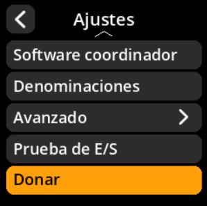

# Información de donaciones

Acceda a la información de donaciones para apoyar el desarrollo de SeedSigner.

## Proceso paso a paso

1. **Navegar**: Menú principal → **Ajustes** → **Donar**
2. **Ver detalles**: Revisar la información y las direcciones de las donaciones
3. **Apoyar el desarrollo**: Considerar contribuir al proyecto

{w=250px align=center}

{w=250px align=center}

{w=250px align=center}
