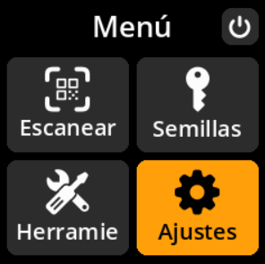
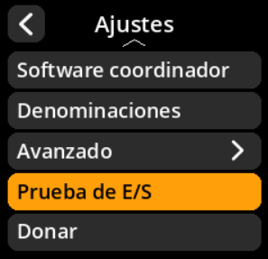
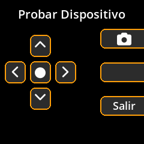

# Pruebas de E/S de hardware

Verifique que todos los componentes del dispositivo funcionen correctamente.

## Proceso paso a paso

1. **Navegar**: Menú principal → **Configuración** → **Prueba de E/S**
2. **Prueba de controladores**: Usa esta pantalla para probar la funcionalidad de entrada/salida de tu dispositivo
3. **Verificar componentes**: Asegúrate de que todos los botones, la pantalla y la cámara funcionen correctamente

{w=250px align=center}

{w=250px align=center}

{w=250px align=center}
