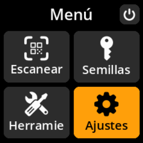

# Configuración del tipo de pantalla

Configure el controlador de pantalla para su configuración de hardware.

## Proceso paso a paso

1. **Navegar**: Menú principal → **Ajustes** → **Avanzado** → **Hardware** → **Display type**
2. **Seleccionar controlador de pantalla**:
     - **st7789 240x240** - Pantalla cuadrada estándar (predeterminada)
     - **st7789 320x240** - Opción de pantalla rectangular
     - **ili9341 320x240 (beta)** - Controlador de pantalla alternativo (beta)

{w=250px align=center}

{w=250px align=center}

{w=250px align=center}

{w=250px align=center}

{w=250px align=center}
