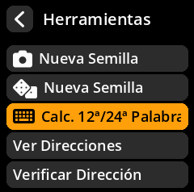
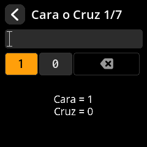
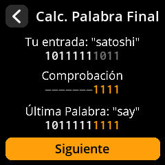
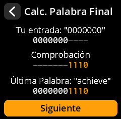

# Cálculo de la generación de la frase semilla de 12.ª/24.ª palabra

Este método de creación de frases semilla permite generar una frase semilla criptográficamente segura introduciendo manualmente 11 palabras (para una frase semilla de 12 palabras) o 23 palabras (para una frase semilla de 24 palabras) y calculando la palabra final con la validación de suma de comprobación adecuada. La palabra final (12.ª o 24.ª) incorpora entropía adicional y garantiza que la frase semilla cumpla con los estándares BIP39.

## Proceso completo con todas las capturas de pantalla

1. **Navegar**: Menú principal → **Herramientas** → **Calc. 12ª/24ª Palabra**

{w=250px align=center}

{w=250px align=center}

2. **Elegir longitud**: Seleccionar **12 palabras** o **24 palabras**

{w=250px align=center}

3. **Ingresar palabras existentes**: Usar el teclado en pantalla Con sugerencias de palabras inteligentes:
     - **Tecla A**: Subir en la lista de sugerencias
     - **Tecla C**: Bajar en la lista de sugerencias
     - **Tecla B**: Seleccionar la palabra sugerida resaltada

{w=250px align=center}

{w=250px align=center}

## Métodos de entropía para calcular la palabra final

El sistema proporciona tres fuentes de entropía diferentes para calcular la palabra final, lo que garantiza la seguridad criptográfica:

{w=250px align=center}

**🪙 Método de Entropía al Lanzamiento de Moneda**

- Lanza una moneda física exactamente 7 veces.
- En cada lanzamiento, selecciona **1 para Cara** o **0 para Cruz** presionando el **Joystick**.
- Este método proporciona 7 bits de entropía para calcular la palabra final.

{w=250px align=center}

- El sistema muestra la cadena binaria y calcula la suma de comprobación.

{w=250px align=center}

**📝 Método de entropía por selección de palabras**

- Elija cualquier palabra de la lista de palabras BIP39 como su entropía. Fuente
- La palabra seleccionada proporciona los bits de entropía necesarios para el cálculo de la palabra final.

{w=250px align=center}

{w=250px align=center}

**🔢 Método de terminación en cero**

- Utiliza una cadena simple de ceros de 7 bits más la suma de comprobación de 4 bits calculada. - Este es el método más simple, pero aun así produce una palabra final válida.

{w=250px align=center}

## Visualización y finalización de la palabra final

**Visualización de la palabra final**

- Muestra la palabra final calculada con todos los detalles de su derivación.
- Muestra la fuente de entropía utilizada y el cálculo de la suma de comprobación.

{w=250px align=center}

**Pantalla de finalización**

- Revisa la frase inicial completada con la palabra final calculada.
- Tu frase inicial ya está lista para ser respaldada y utilizada.

{w=250px align=center}

> **📚 Nota técnica**: La palabra final de cualquier semilla BIP39 contiene bits de entropía y bits de suma de comprobación. La suma de comprobación garantiza la validez matemática de la frase inicial y ayuda a detectar errores de transcripción.
