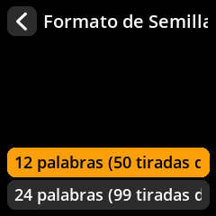
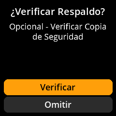

# Generación de Semillas con Dados

Genere semillas con dados físicos para máxima seguridad y aleatoriedad demostrable. Este método es el preferido por usuarios preocupados por la seguridad que desean un control total sobre la fuente de aleatoriedad.

## Proceso completo paso a paso con todas las capturas de pantalla

1. **Navegar**: Menú principal → **Herramientas**

{w=250px align=center}

2. **Seleccionar método**: Elija **"Nueva semilla"** con el icono del dado

{w=250px align=center}

3. **Seleccionar longitud**:
     - **12 palabras** requiere 50 tiradas de dados
     - **24 palabras** requiere 99 tiradas de dados (recomendado)

{w=250px align=center}\

4. **Preparar dados físicos**: Usar un dado estándar de 6 caras

5. **Tira y entra**:
     - Tira tu dado físico
     - Selecciona el número correspondiente (1-6) en la pantalla pulsando el **joystick**
     - Repite el proceso para todas las tiradas necesarias

{w=250px align=center}

6. **Completar todas las tiradas**: El indicador de progreso muestra tu estado de finalización

{w=250px align=center}

7. **Aceptar la advertencia de seguridad**: Pulsa "Entiendo" después de leer la advertencia de información clasificada

{w=250px align=center}

8. **Registrar palabras generadas**: Anote todas las palabras semilla en orden.

{w=250px align=center}

9. **Verificar la copia de seguridad**: Complete el proceso de verificación.

{w=250px align=center}

> **🎲 ¿Por qué usar dados?** Los dados físicos proporcionan una aleatoriedad real que no se ve comprometida por vulnerabilidades de software, puertas traseras de hardware ni interferencias electromagnéticas. Este método le brinda control total sobre la fuente de entropía.
