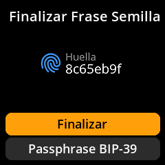

# Añadiendo la contraseña BIP-39

Mejora la seguridad de tus semillas con una contraseña opcional. Esto crea una billetera completamente diferente, incluso con las mismas contraseñas.

## Proceso paso a paso con capturas de pantalla

1. **Introducción de la contraseña**: En la pantalla "Finalizar semilla", seleccione **"Contraseña BIP-39"**

{w=250px align=center}

2. **Introduzca su contraseña**: Use el teclado en pantalla con varios conjuntos de caracteres:

- **Modo predeterminado**: Minúsculas (a-z)

{w=250px align=center}

- **Tecla A**: Cambiar a mayúsculas (A-Z)

{w=250px align=center}

- **Tecla B**: Números de acceso (0-9) y símbolos

{w=250px align=center}

{w=250px align=center}

{w=250px align=center}

3. **Revisar su entrada**: Verifique la precisión de su contraseña.

4. **Confirmar o editar**: Seleccione **"Listo"** para confirmar o hacer correcciones si es necesario.

{w=250px align=center}

> **🔐 Nota de seguridad importante**: Una contraseña BIP-39 crea una billetera completamente diferente a partir de las mismas palabras clave. Debe guardar su contraseña por separado de las palabras clave. Perder la contraseña significa perder el acceso a esa billetera para siempre.
