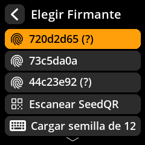

# ✍️ Firmar Transacción de Bitcoin (PSBT)

Apruebe y firme de forma segura las transacciones de Bitcoin creadas por el software de su billetera. PSBT (Transacción de Bitcoin Parcialmente Firmada) es el formato estándar para transacciones sin firmar.

## Proceso completo paso a paso con capturas de pantalla

1. **Firma de acceso**: Desde la pantalla principal de tu semilla, selecciona **"Escanear PSBT"**

{w=250px align=center}

2. **Escanear QR de transacción**: Apunta con la cámara al código QR de la transacción generado por el software de tu monedero.

{w=250px align=center}

3. **Revisar detalles de la transacción**: Verifica cuidadosamente TODA la información mostrada.

{w=250px align=center}

**Aspectos críticos a verificar:**

- ✅ **Dirección del destinatario** - Confirme que coincida con su destino
- ✅ **Cantidad enviada** - Verifique la cantidad exacta de Bitcoin
- ✅ **Comisión de transacción** - Verifique que la comisión sea razonable
- ✅ **Cambiar de dirección** - Asegúrese de que el cambio regrese a su billetera

4. **Seleccionar semilla de firma**: Elija la semilla adecuada si se cargan varias

{w=250px align=center}

5. **Autorizar firma**: Confirme que desea firmar esta transacción

{w=250px align=center}

6. **Transmitir transacción**: Escanee el código QR firmado resultante en Software de su billetera

7. **Confirmar transmisión**: Su billetera transmitirá la transacción a la red Bitcoin

> **🚨 Comprobación de seguridad crítica**: Las transacciones de Bitcoin son irreversibles una vez transmitidas a la red. Verifique SIEMPRE la dirección y el importe del destinatario antes de firmar. Compruebe que la dirección del destinatario coincida exactamente con el destino deseado.
