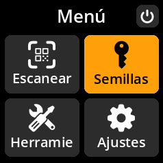
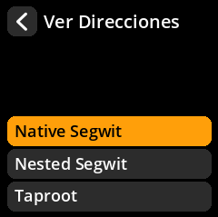
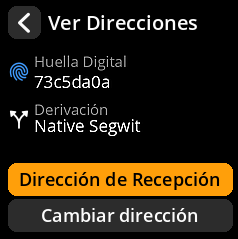

# Generar direcciones de recepción

Consulta y comparte tus direcciones de recepción de Bitcoin para aceptar pagos.

## Proceso completo paso a paso con capturas de pantalla

**Ruta de navegación**: `Inicio → Semillas → [Seleccionar semilla] → Ver Direccions`

{w=250px align=center}

{w=250px align=center}

{w=250px align=center}

**Flujo del proceso**:

1. **Selección del tipo de script** → Elija su formato de dirección preferido

{w=250px align=center}

2. **Generación de dirección** → Seleccione "Dirección de recepción"

{w=250px align=center}

3. **Lista de direcciones** → Examinar las direcciones disponibles (paginadas: 10 por vista)

{w=250px align=center}

4. **Generación de código QR** → Toque cualquier dirección para obtener un código QR para compartir

{w=250px align=center}

> **💡 Práctica recomendada**: Genera una nueva dirección de recepción para cada transacción para mantener la privacidad. Las direcciones de Bitcoin se pueden reutilizar, pero no se recomienda por motivos de privacidad.
