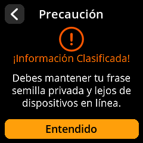
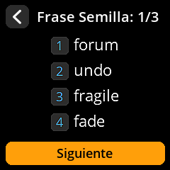

# Ver palabras clave

Acceda a sus palabras clave para verificar copias de seguridad o realizar recuperaciones.

## Proceso completo paso a paso con capturas de pantalla

1. **Navegar**: `Inicio → Semillas → [Seleccionar Semilla] → Salvar Semilla → Ver frase semilla`

{w=250px align=center}

{w=250px align=center}

{w=250px align=center}

{w=250px align=center}

2. **Aceptar advertencia de seguridad**: Pulse **"Entiendo"** para ver la advertencia de información clasificada.

{w=250px align=center}

3. **Revisar todas las palabras**: Vea su frase clave completa (4 palabras a la vez).

{w=250px align=center}

4. **Verificación opcional**: Complete el proceso de verificación de la copia de seguridad seleccionando "Verificar" o "Omitir" para continuar.

{w=250px align=center}

5. **Salida segura**: Asegúrate de estar en un lugar privado antes de ver.

> **🔐 Advertencia de seguridad crítica**: Ve las palabras clave solo en un lugar completamente privado y seguro, lejos de cámaras, otras personas y dispositivos de grabación. Considera cubrir la pantalla desde diferentes ángulos.
