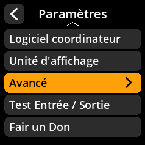
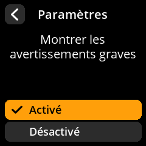

# Avertissements critiques

Configurer l'affichage des avertissements de sécurité critiques.

## Procédure étape par étape

1. **Naviguer** : Paramètres → **Avancé** → **Montrer les avertissements graves**
2. **Choisir le mode d'affichage** :
   - **Activé** - Montrer les avertissements graves (par défaut)
   - **Désactivé** - Masquer les avertissements graves

{w=250px align=center}

{w=250px align=center}

{w=250px align=center}

{w=250px align=center}
