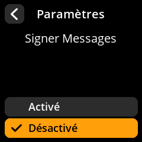

# Signer Messages

Activer la fonctionnalité de signature cryptographique des messages.

## Procédure étape par étape

1. **Naviguer** : Paramètres → **Avancé** → **Signer Messages**
2. **Choisir le mode** :
   - **Activé** : Autoriser la signature des messages
   - **Désactivé** : Désactiver la signature des messages (par défaut)

{w=250px align=center}

{w=250px align=center}

{w=250px align=center}

{w=250px align=center}
