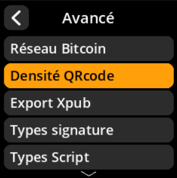
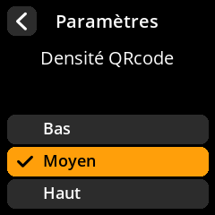

# Densité QRcode

Ajustez la densité des codes QR générés pour équilibrer la taille et la lisibilité.

## Procédure étape par étape

1. **Naviguer** : Paramètres → **Avancé** → **Densité QRcode**
2. **Choisir la densité** :
   - **Bas** : Codes QR plus grands et plus faciles à scanner
   - **Moyen** : Taille et compatibilité équilibrées (par défaut)
   - **Haut** : Codes QR plus petits et plus denses en données

{w=250px align=center}

{w=250px align=center}

{w=250px align=center}

{w=250px align=center}
