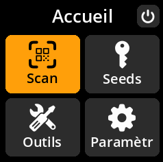

# Configuration initiale et démarrage

## Démarrage de votre appareil

1. **Connexion à l'alimentation** : Utilisez un câble micro-USB pour alimenter votre SeedSigner.
2. **Attendre le démarrage** : Patientez quelques secondes pendant la séquence de démarrage complète.
3. **Fermer la notification initiale** : Appuyez sur n'importe quelle touche (A, B ou C) pour fermer le message « Vous pouvez retirer la carte SD ».

{w=250px align=center}

> **💡 Conseil de pro** : Une fois le système d'exploitation chargé dans la RAM, vous pouvez retirer la carte SD en toute sécurité. Cela permet d'éviter que des phrases clés ne soient stockées accidentellement sur l'appareil, préservant ainsi la sécurité.
