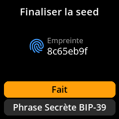

# Saisie manuelle des mots clés

Saisissez votre phrase mnémotechnique existante à l'aide du clavier à l'écran.

## Procédure complète étape par étape avec toutes les captures d'écran

1. **Naviguer** : Menu principal → **Seeds** → **Charger une seed**

{w=250px align=center}

{w=250px align=center}

2. **Choisir la longueur** : Sélectionnez **« Entrer la seed 12 mots »** ou **« Entrer la seed 24 mots »**

{w=250px align=center}

{w=250px align=center}

3. **Saisir chaque mot** :
     - Utiliser le clavier à l'écran avec suggestions de mots intelligentes
     - Taper les premières lettres et sélectionner parmi les suggestions pour une saisie plus rapide
     - **Touche A** : Monter dans la liste des suggestions
     - **Touche C** : Descendre dans la liste des suggestions
     - **Touche B** : Sélectionner le mot suggéré en surbrillance

{w=250px align=center}

4. **Vérifier l'empreinte de la graine** : Vérifier l'identifiant unique sur l'écran « Finaliser la graine »

{w=250px align=center}

5. **Chargement complet** :
     - Sélectionnez **« Fait »** pour charger la graine telle quelle
     - Ou sélectionnez **« Phrase secrète BIP-39 »** pour renforcer la sécurité

> **⚡ Astuce rapide** : La fonction de suggestion de mots accélère considérablement la saisie. Saisissez uniquement les 2 ou 3 premières lettres de chaque mot et faites votre choix parmi les suggestions filtrées plutôt que de saisir chaque lettre individuellement.
