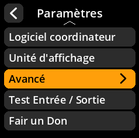
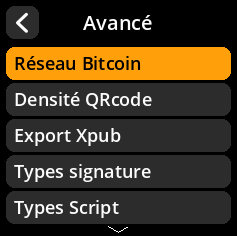
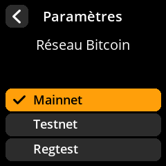

# Sélection du réseau Bitcoin

Choisissez le réseau Bitcoin à utiliser pour les adresses et les transactions.

## Procédure étape par étape

1. **Naviguer** : Paramètres → **Avancé** → **Réseau Bitcoin**
2. **Sélectionner le réseau** :
   - **Mainet** - Réseau Bitcoin réel (par défaut pour une utilisation normale)
   - **Testnet** - Réseau de test pour le développement et l'expérimentation
   - **Regtest** - Réseau de test de régression local

{w=250px align=center}

{w=250px align=center}

{w=250px align=center}

{w=250px align=center}

> **⚠️ Avertissement réseau** : Assurez-vous toujours d'utiliser le réseau principal pour les transactions Bitcoin réelles. Le réseau de test et les tests d'enregistrement sont uniquement destinés au développement.
