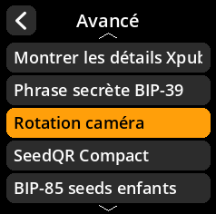
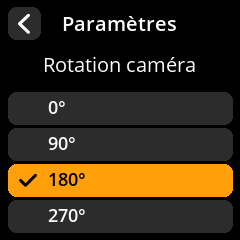

# Rotation caméra

Ajustez l'orientation de la caméra en fonction de la configuration de votre appareil.

## Procédure étape par étape

1. **Naviguer** : Paramètres → **Avancé** → **Rotation caméra**
2. **Sélectionner la rotation** :
   - **0 degré** - Aucune rotation
   - **90 degrés** - Quart de tour dans le sens horaire
   - **180 degrés** - À l'envers (par défaut pour la plupart des configurations)
   - **270 degrés** - Quart de tour dans le sens antihoraire

{w=250px align=center}

{w=250px align=center}

{w=250px align=center}

{w=250px align=center}
