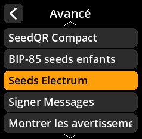
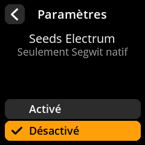

# Seeds Electrum

Configurer la prise en charge des phrases de type « seeds » Electrum.

## Procédure étape par étape

1. **Naviguer** : Paramètres → **Avancé** → **Seeds Electrum**
2. **Choisir le mode** :
   - **Activé** - Prise en charge du format de données Electrum
   - **Désactivé** - Standard BIP-39 uniquement (par défaut)

{w=250px align=center}

{w=250px align=center}

{w=250px align=center}

{w=250px align=center}
