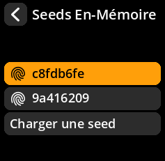
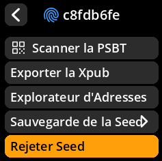
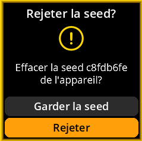
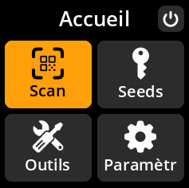

# Supprimer la graine chargée

Supprimez en toute sécurité la graine actuelle de la mémoire une fois vos opérations terminées.

## Procédure complète étape par étape avec toutes les captures d'écran

1. **Naviguer** : `Accueil → Seeds → [Sélectionnez la graine] → Rejeter Seed`

{w=250px align=center}

{w=250px align=center}

{w=250px align=center}

2. **Confirmer le rejet** : Sélectionnez **« Rejeter »** pour supprimer la graine Mémoire

{w=250px align=center}\

3. **Retour au menu principal** : Vous serez renvoyé au menu principal sans seed chargé.

{w=250px align=center}

> **🧹 Effacement de la mémoire** : La suppression d'une seed la supprime complètement de la mémoire de l'appareil. Il s'agit d'une bonne pratique de sécurité lors du passage d'une seed à une autre ou à la fin d'une opération.
