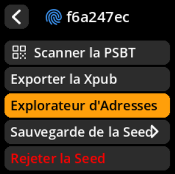
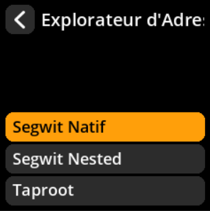
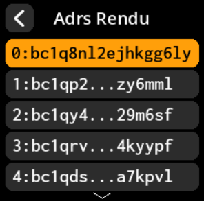

# Générer les adresses de monnaie

Afficher les adresses utilisées pour le retour de monnaie

## Procédure complète étape par étape avec toutes les captures d'écran

**Chemin de navigation** : `Accueil → Seeds → [Sélectionner Seed] → Explorateur d'Adresses`

{w=250px align=center}

{w=250px align=center}

{w=250px align=center}

**Flux de processus** :

1. **Sélection du type de script** → Choisissez votre Format d'adresse préféré

{w=250px align=center}

2. **Modifier l'accès** → Sélectionner **« Adresses du Rendu »** au lieu de **« Réception »**

{w=250px align=center}

3. **Gestion des adresses** → Parcourir les adresses de modification (paginées : 10 par vue)

{w=250px align=center}

4. **Accès par code QR** → Appuyer sur n'importe quelle adresse pour afficher le code QR

{w=250px align=center}

#### Informations clés

**Types d'adresses disponibles** :

- Segwit natif (recommandé)
- Segwit Nested (compatibilité)
- Taproot (fonctionnalités avancées)

**Bonne pratique en matière de confidentialité** : Utiliser une nouvelle adresse de réception pour chaque transaction

**Note technique** : Les adresses de changement gèrent automatiquement le solde restant des transactions

> **💡 Bonne pratique** : Les adresses de changement sont automatiquement gérées par votre portefeuille ; vous n'avez généralement pas besoin de les générer ou de les partager manuellement.
